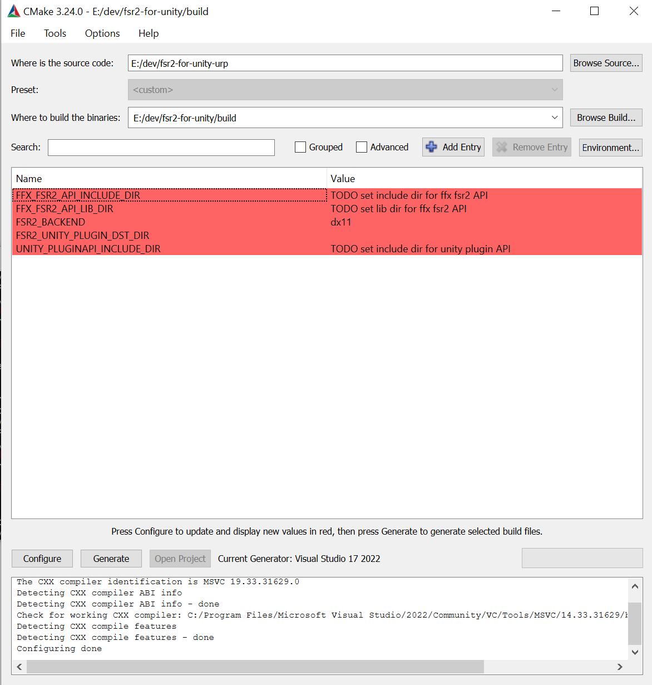
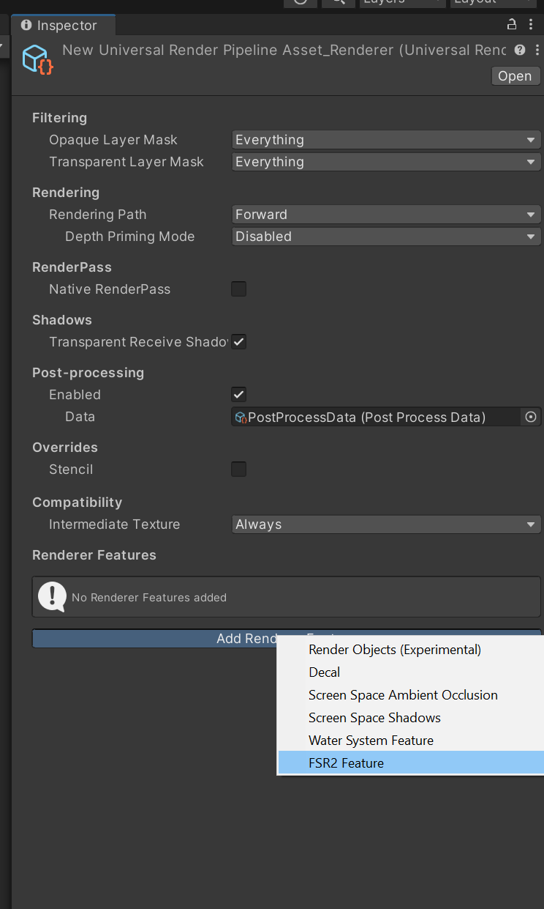
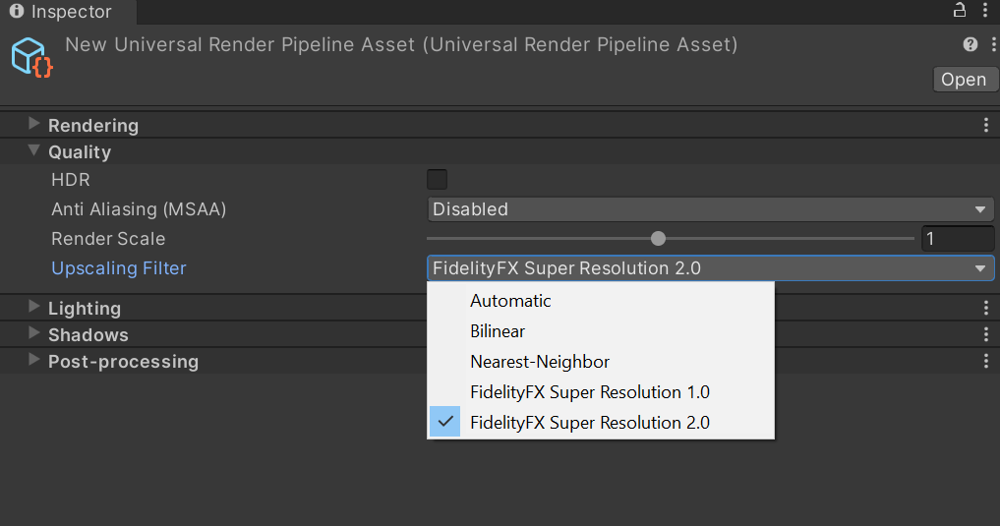
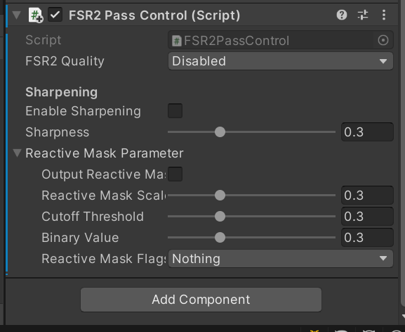

# Integrating AMD FidelityFX™ Super Resolution 2 (FSR 2) into Unity URP

AMD FidelityFX Super Resolution 2 (FSR2) is an open source, high-quality solution for producing high resolution frames from lower resolution inputs. FSR2 uses temporal feedback to reconstruct high-resolution images while maintaining and even improving image quality compared to native rendering.

FSR2 can enable “practical performance” for costly render operations, such as hardware ray tracing.

## Version

While this patch targets URP 12.1.7 in particular, you can still use this patch for other versions (including newer) with a few careful changes. Note that this version of the patch supports DX11 only.

## Integration method

1. Apply [`0001-Added-FSR2-support-for-URP.patch`](src/patch/0001-Added-FSR2-support-for-URP.patch) to your local URP repository.
   - If you can't use `git apply <path to patch>` directly due to your own modifications, merge this patch into your local code manually.

2. Apply [`0001-fsr-2.2-dx11-backend.patch`](src/patch/0001-fsr-2.2-dx11-backend.patch) to [FidelityFX-FSR2](https://github.com/GPUOpen-Effects/FidelityFX-FSR2) @[v2.2.1](https://github.com/GPUOpen-Effects/FidelityFX-FSR2/tree/v2.2.1).

3. Follow the build instruction from [here](https://github.com/GPUOpen-Effects/FidelityFX-FSR2#building-the-sample) to compile the FSR 2 API library.
   - For DirectX® 11, you should run `GenerateSolutionDX11.bat` instead of `GenerateSolutions.bat` to get the Visual Studio® solution file (.sln).

4. Generate the VisualStudio solution (.sln)  file with CMake for the plugin.

   

   - `UNITY_PLUGINAPI_INCLUDE_DIR`: Unity plugin API include directory.
   - `FFX_FSR2_API_INCLUDE_DIR`: FSR 2 API include directory.
   - `FFX_FSR2_LIB_DIR`: FSR 2 link library directory.
   - `FSR2_BACKEND`: Set the backend. NOTE! Currently only dx11 is supported.
   - `FSR2_UNITY_PLUGIN_DST_DIR`: Destination directory for compiled `fsr2-unity-plugin[d].dll`. 

5. Add `FSR2Feature` into your URP renderer data.

   

6. Choose **FidelityFX Super Resolution 2.0** as your Upscaling Filter and turn off MSAA.

   
   

7. Add `FSR2PassControl` to `GameObject` where it has a camera, and you want use FSR 2 to upscale the output of that camera.

   
   

   
   - Disable all the anti-aliasing methods applied to this camera.
   - Disable any post effects, e.g. Panini Projection, that cannot be used on the same camera with FSR 2. Try to use multi-cameras and put the effect on a different camera.
   - If you want FSR 2 to automatically generate reactive mask for you, you should make sure **Output Reactive Mask** is checked. Otherwise, you should provide your own masks with `ReactiveMaskParameter.OptReactiveMaskTex` and `ReactiveMaskParameter.OptTransparencyAndCompositionTex`.

To find out more about FSR 2, please visit our [FidelityFX FSR 2 page on GPUOpen](https://gpuopen.com/fidelityfx-superresolution-2/).

This plugin is developed by AMD and is distributed subject to the MIT license. For more information about the plugin, FSR, or if you have any support questions, please visit [GPUOpen](https://gpuopen.com/).

